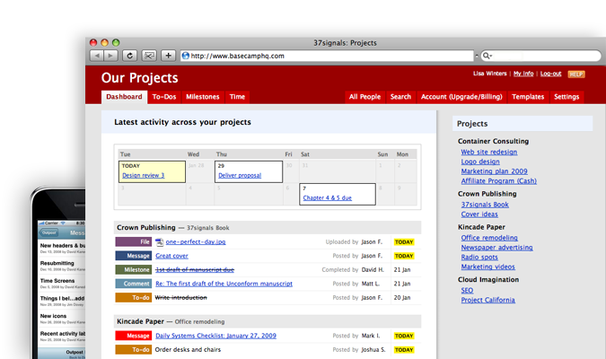

!SLIDE

# Cours de Ruby on Rails #

## Par Cyril Mougel ##
### cyril.mougel@gmail.com ###

!SLIDE

# Première release en 2004 #

!SLIDE center

# Créé par David Heinemeier Hansson « DHH » #

Image de <a rel="cc:attributionURL"     href="http://www.flickr.com/photos/62337512@N00/">Jesper Rønn-Jensen</a> <a rel="license" href="http://creativecommons.org/licenses/by/2.0/">(CC)</a>

!SLIDE center

# De le société 37 Signals #

!SLIDE center

# Extrait de BaseCamp #

!SLIDE

# En ruby car ... #

!SLIDE

# Possibilité d'introspection du code #

## User.find_by_name('hello') ##

!SLIDE center

# Une syntaxe simple #

    @@@ ruby
    class Project < ActiveRecord::Base
      has_many :users
    end

!SLIDE

# Le concept ? #

!SLIDE

# Concu pour les développeurs #
# Par les développeurs #

!SLIDE

# Un cadre de travail minimal #

!SLIDE

# Mais complet #

!SLIDE

# Uniquement pour faire du Web #

!SLIDE

# et que du web #

!SLIDE

# « Convention over Configuration » #

!SLIDE

# Moins on a de fichier de configuration #

!SLIDE

# Moins on a de fichier à éditer #

!SLIDE

# « Don't repeat Yourself » #

!SLIDE

# Arrêtons de copier coller notre code #
# à d'autre endroit #

!SLIDE

# Un seul langage a apprendre #

!SLIDE

# Ruby on Rail est #
# MVC #

!SLIDE

# Model #
# View #
# Controller #

!SLIDE

# Le modèle ( Model ) #

!SLIDE

# Couche métier #

!SLIDE

# Correspondance avec les Bases de données #

!SLIDE

# Les vues ( Views ) #

!SLIDE

# La présentation HTML #

!SLIDE

# Juste du HTML #

!SLIDE

# Les contolleurs ( Controllers ) #

!SLIDE

# Dispatch les URL #

!SLIDE

# Une URL == Une action #

!SLIDE

# Un hierachie de fichier défini #

!SLIDE

# Chaque couche à sa place #

!SLIDE

# model #
# == #
# app/models #

!SLIDE

# view #
# == #
# app/views #

!SLIDE

# controller #
# == #
# app/controllers #

!SLIDE

# Un dossier de configuration #
# == #
# /config #

!SLIDE

# Un dossier de librairie #
# == #
# /lib #

!SLIDE

# Un seul fichier pour gérer les URL #

!SLIDE

# route.rb #
